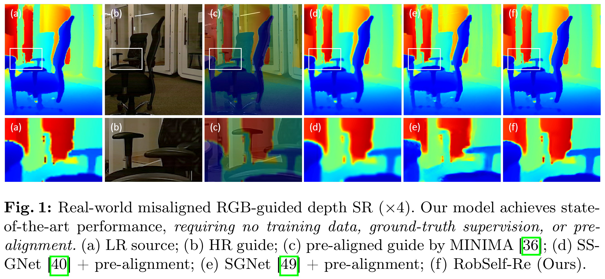
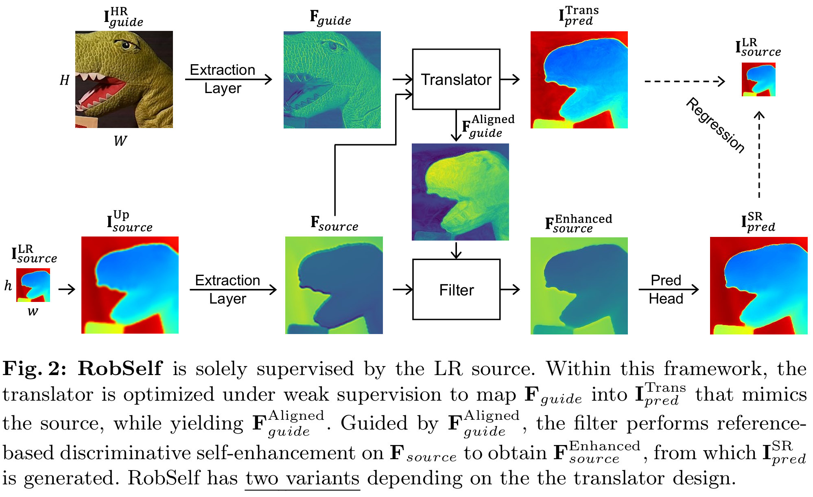

# RobSelf
PyTorch implementation of "Robust Self-Supervised Cross-Modal Super-Resolution against Real-World Misaligned Observations"  
[[arXiv](https://arxiv.org/abs/2602.18822), [supp](https://drive.google.com/file/d/1fqTYuSY7Qp7PFHiHViZs7y6lz6Bws7ws/view?usp=sharing)] [ECCV paper]

## Updates
**[2026/06/18]** Our paper was accepted to ECCV 2026. See you in Malmö, Sweden.  
**[2026/07/30]** Our collected real-world misaligned dataset (RealMisSR) has been uploaded. The code will be released soon.

## Abstract
Cross-modal super-resolution (SR) on real-world misaligned data is challenging, as only unlabeled low-resolution (LR) source and high-resolution (HR) guide images with complex spatial misalignment are available. Previous methods either rely on simulated training data or adopt suboptimal alignment strategies that overlook cross-modal dependencies, limiting their practical performance. To address these issues, we propose RobSelf, a self-supervised model that jointly optimizes a misalignment-aware feature translator and a content-aware reference filter online. The translator resolves unsupervised cross-modal and cross-resolution alignment via weakly-supervised, misalignment-aware translation, yielding an aligned guide feature. Guided by this feature, the filter performs reference-based discriminative self-enhancement on the source, enabling SR prediction with high resolution and high fidelity. Experiments on synthesized data and collected real-world data demonstrate that RobSelf achieves state-of-the-art performance, outperforming existing self-supervised and supervised methods. Moreover, it achieves superior efficiency, being up to 15.3$\times$ faster than prior self-supervised methods.
  
<p align="center">  </p>

<p align="center">  </p>

## Code
TODO.

## RealMisSR Dataset
Our collected real-world misaligned data can be downloaded [here](https://drive.google.com/drive/folders/16gWaPR3mryYSdbAGomWXgK4KGdakFT-4?usp=drive_link). 
- **RGB-depth subset:** 52 groups of simple cases with inherent cross-sensor misalignment; and 60 groups of complex cases with inherent cross-sensor misalignment and random viewpoint variation.
- **RGB-NIR subset:** 50 groups of simple cases with inherent cross-sensor misalignment; and 30 groups of complex cases with inherent cross-sensor misalignment and random object motion.
- Please refer to our paper for more details. 

**License and Usage:** The dataset is provided exclusively for academic research purposes. Any commercial use, redistribution, or modification of the dataset without prior permission is prohibited. Please cite our paper if you find the dataset useful.

## Citation
```
@InProceedings{RobSelf_2026_ECCV,
  author    = {Dong, Xiaoyu and Li, Jiahuan and Cui, Ziteng and Yokoya, Naoto},
  title     = {Robust Self-Supervised Cross-Modal Super-Resolution against Real-World Misaligned Observations},
  booktitle = {ECCV},
  year      = {2026}
}
```

## Contact
Xiaoyu Dong at dong@ms.k.u-tokyo.ac.jp
